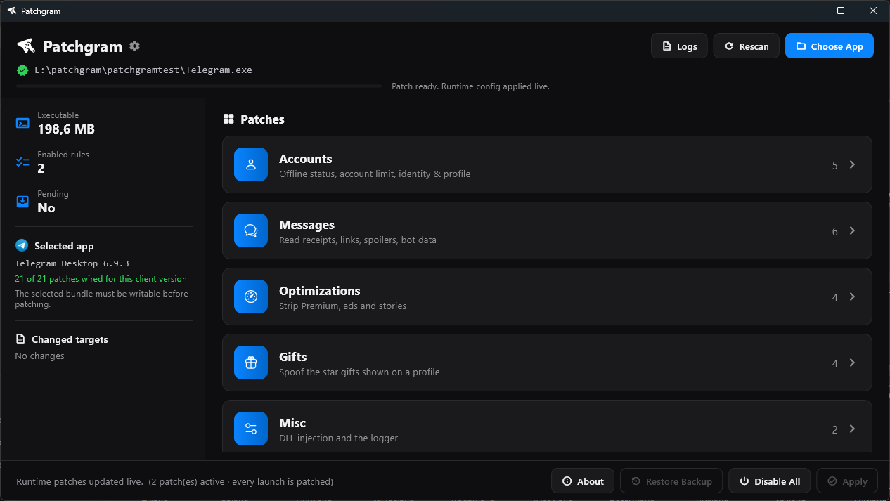

# Patchgram

Required: Windows 10/11 x64, [Telegram Desktop 6.9.3](https://telegram.org/dl/desktop/win64)

Patch list: [RU](patchlist_ru.md) / [EN](patchlist.md)

The build is unsigned, so on first launch Windows SmartScreen may show "Windows protected your PC" — click **More info → Run anyway**.

## Patches

The patcher groups patches into five sections. Each row links to the code that implements it. Runtime
behavior lives in the injected DLL: MTProto request/response rewriters in
[`dll/engine_patches.c`](dll/engine_patches.c) and the two hooks + reversible byte-patch (AOB) engine in
[`dll/patchgram.cpp`](dll/patchgram.cpp). Plain-language descriptions of every patch are in
[patchlist.md](patchlist.md) ([RU](patchlist_ru.md)). To author a new patch (Windows ABI/Qt5 specifics,
how to find sites, write/build a patch, tools), see [docs/patch-authoring.md](docs/patch-authoring.md).

> Code links are pinned to commit [`b617126`](https://github.com/patchgram/win/tree/b617126) so the line
> numbers stay valid as the DLL evolves. `dll` patches = a runtime rewriter / hook; `binary` patches = an
> AOB byte-patch (`PgBytePatch`) located in `.text` and reverted on toggle-off.

### Accounts

| Patch | Type | Code |
| --- | --- | --- |
| Always offline | `dll` | [engine_patches.c:2168](https://github.com/patchgram/win/blob/b617126/dll/engine_patches.c#L2168) — force `account.updateStatus` offline in `pg_apply_request` |
| Don't share phone when adding contacts | `dll` | [engine_patches.c:2175](https://github.com/patchgram/win/blob/b617126/dll/engine_patches.c#L2175) — clear `add_phone_privacy_exception` in `contacts.addContact` |
| 999 accounts | `binary` | [patchgram.cpp:326](https://github.com/patchgram/win/blob/b617126/dll/patchgram.cpp#L326) — `g_acc1Patch` (+3 more sites) |
| Hide self phone | `dll` | [patchgram.cpp:601](https://github.com/patchgram/win/blob/b617126/dll/patchgram.cpp#L601) — `pg_apply_self_phone_hook` |
| Custom account settings | `dll` | grouped → [subpatches ↓](#custom-account-settings-subpatches) |

### Messages

| Patch | Type | Code |
| --- | --- | --- |
| Message settings | `dll` | grouped → [subpatches ↓](#message-settings-subpatches) |
| Show bot callback-data on hover | `binary` | [patchgram.cpp:359](https://github.com/patchgram/win/blob/b617126/dll/patchgram.cpp#L359) — `g_cbhBPatch` / `g_cbhDPatch` |
| Sensitive blur | `binary` | [patchgram.cpp:271](https://github.com/patchgram/win/blob/b617126/dll/patchgram.cpp#L271) — `g_blurPatch` |
| More recent stickers | `binary` | [patchgram.cpp:239](https://github.com/patchgram/win/blob/b617126/dll/patchgram.cpp#L239) — `g_recentPatch` (`kRecentDisplayLimit`) |
| Open links without warning | `binary` | [patchgram.cpp:373](https://github.com/patchgram/win/blob/b617126/dll/patchgram.cpp#L373) — `g_links1Patch` / `g_links2Patch` |
| Disable media spoilers | `binary` | [patchgram.cpp:284](https://github.com/patchgram/win/blob/b617126/dll/patchgram.cpp#L284) — `g_spoilPhotoPatch` / `g_spoilDocPatch` |

### Optimizations

| Patch | Type | Code |
| --- | --- | --- |
| Disable Premium, Stars, TON & Gifts | `dll` | [engine_patches.c:781](https://github.com/patchgram/win/blob/b617126/dll/engine_patches.c#L781) — inject `premium_purchase_blocked` into `help.appConfig` (Premium UI; other subs inert on x64) |
| Disable premium effects | `binary` | [patchgram.cpp:296](https://github.com/patchgram/win/blob/b617126/dll/patchgram.cpp#L296) — `g_preffPatch` |
| Hide stories | `dll` | [patchgram.cpp:253](https://github.com/patchgram/win/blob/b617126/dll/patchgram.cpp#L253) — `g_storiesUserPatch` / `g_storiesChanPatch` + request drops |
| Disable ads | `dll` | [engine_patches.c:2202](https://github.com/patchgram/win/blob/b617126/dll/engine_patches.c#L2202) — drop `getSponsoredMessages` / `help.getPromoData` |

### Gifts

All Gifts patches rewrite the `payments.savedStarGifts` / `payments.starGifts` responses inside the DLL.

| Patch | Type | Code |
| --- | --- | --- |
| Spoof profile gifts | `dll` | [engine_patches.c:1004](https://github.com/patchgram/win/blob/b617126/dll/engine_patches.c#L1004) — `pg_gift_spoof` (extras [:916](https://github.com/patchgram/win/blob/b617126/dll/engine_patches.c#L916)) |
| Spoof profile unique gifts | `dll` | [engine_patches.c:1747](https://github.com/patchgram/win/blob/b617126/dll/engine_patches.c#L1747) — `pg_gift_unique_rebuild` (blob [:1680](https://github.com/patchgram/win/blob/b617126/dll/engine_patches.c#L1680)) |
| Fake transfer | `dll` | [engine_patches.c:1936](https://github.com/patchgram/win/blob/b617126/dll/engine_patches.c#L1936) — `pg_fake_transfer` (form [:1957](https://github.com/patchgram/win/blob/b617126/dll/engine_patches.c#L1957)) |
| Show hidden gifts | `dll` | [engine_patches.c:1080](https://github.com/patchgram/win/blob/b617126/dll/engine_patches.c#L1080) — `pg_inject_hidden_gifts` |

Custom-emoji auto-load by id is shared by the gift patches — append
[engine_patches.c:2013](https://github.com/patchgram/win/blob/b617126/dll/engine_patches.c#L2013) `pg_autoload_append_emoji`,
capture [:1631](https://github.com/patchgram/win/blob/b617126/dll/engine_patches.c#L1631) `pg_unique_capture`.

### Misc

| Patch | Type | Code |
| --- | --- | --- |
| DLL injection | `dll` | [launcher/launcher.c](https://github.com/patchgram/win/blob/b617126/launcher/launcher.c) — renames `Telegram.exe` → `Telegram_real.exe`, starts it suspended, injects `Patchgram.dll`, resumes |
| MTProto request/response logger | `dll` | [patchgram.cpp:467](https://github.com/patchgram/win/blob/b617126/dll/patchgram.cpp#L467) `hkTryToReceive` / [:511](https://github.com/patchgram/win/blob/b617126/dll/patchgram.cpp#L511) `hkSendPrepared` |

### Custom account settings subpatches

| Subpatch | Code |
| --- | --- |
| Custom Stars / Custom TON | [patchgram.cpp:692](https://github.com/patchgram/win/blob/b617126/dll/patchgram.cpp#L692) — `QLocale::toString` hook (self id/balance sites) |
| Custom level rating | [patchgram.cpp:653](https://github.com/patchgram/win/blob/b617126/dll/patchgram.cpp#L653) — `setFlags` hook |
| Visual peer badge | [patchgram.cpp:625](https://github.com/patchgram/win/blob/b617126/dll/patchgram.cpp#L625) — `setFlags` hook (verified/scam/fake bits) |
| Bot verification | [patchgram.cpp:644](https://github.com/patchgram/win/blob/b617126/dll/patchgram.cpp#L644) — `setFlags` hook + `pg_build_bot_verify` [:577](https://github.com/patchgram/win/blob/b617126/dll/patchgram.cpp#L577) |
| Local Telegram Premium | [patchgram.cpp:633](https://github.com/patchgram/win/blob/b617126/dll/patchgram.cpp#L633) — `setFlags` premium bit `0x4000` |
| Account freeze | [engine_patches.c:733](https://github.com/patchgram/win/blob/b617126/dll/engine_patches.c#L733) — `pg_account_freeze` |
| Custom phone number | [patchgram.cpp:601](https://github.com/patchgram/win/blob/b617126/dll/patchgram.cpp#L601) — `pg_apply_self_phone_hook` |
| Custom userID | [patchgram.cpp:692](https://github.com/patchgram/win/blob/b617126/dll/patchgram.cpp#L692) — `QLocale::toString` hook |
| Local attached channel | [patchgram.cpp:657](https://github.com/patchgram/win/blob/b617126/dll/patchgram.cpp#L657) — `setFlags` writes `_personalChannelId` |
| Fragment phone | [engine_patches.c:1196](https://github.com/patchgram/win/blob/b617126/dll/engine_patches.c#L1196) — `pg_fragment_phone` |
| Custom list usernames | [engine_patches.c:1501](https://github.com/patchgram/win/blob/b617126/dll/engine_patches.c#L1501) — `pg_custom_usernames` |

### Message settings subpatches

| Subpatch | Code |
| --- | --- |
| Typing activity | [engine_patches.c:2182](https://github.com/patchgram/win/blob/b617126/dll/engine_patches.c#L2182) — drop `messages.setTyping` |
| Read receipts | [engine_patches.c:2193](https://github.com/patchgram/win/blob/b617126/dll/engine_patches.c#L2193) — drop read-history requests |
| Local drafts | [engine_patches.c:2039](https://github.com/patchgram/win/blob/b617126/dll/engine_patches.c#L2039) — drop `messages.saveDraft` in `pg_apply_request` |
| Custom Fact Check | [engine_patches.c:1312](https://github.com/patchgram/win/blob/b617126/dll/engine_patches.c#L1312) — `pg_fact_check` |
| Copy/save protect content | [engine_patches.c:671](https://github.com/patchgram/win/blob/b617126/dll/engine_patches.c#L671) — `pg_strip_noforwards` |
| Disable TTL | [patchgram.cpp:299](https://github.com/patchgram/win/blob/b617126/dll/patchgram.cpp#L299) — view-once `ttl_seconds` byte-patches |

The **Disable ads** subpatches (Telegram Ads / Proxy sponsor) are the two request drops at
[engine_patches.c:2202](https://github.com/patchgram/win/blob/b617126/dll/engine_patches.c#L2202). On Windows x64 most
**Disable Premium, Stars, TON & Gifts** subpatches are inert (no appConfig gate) — only Premium UI is functional;
see [patchlist.md](patchlist.md) and the notes at
[engine_patches.c:122](https://github.com/patchgram/win/blob/b617126/dll/engine_patches.c#L122).
